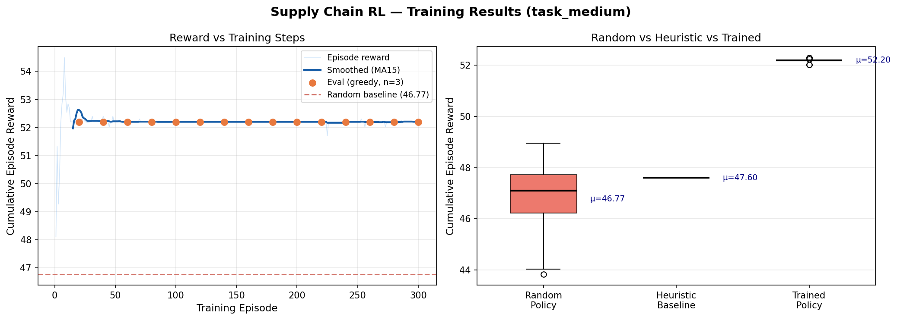

# 🏭 Supply Chain Disruption Management — OpenEnv v2.0

> **Multi-agent RL environment for AI-driven global logistics under uncertainty**

[](https://huggingface.co/openenv)
[](https://huggingface.co/spaces/your-username/supply-chain-openenv)
[](LICENSE)

---

## 🔍 Problem Statement

Every day, global supply chains make millions of routing decisions under uncertainty: which carrier to use, how to respond to port closures, when to pay a speed premium vs defer to preserve budget. Poor decisions cascade — a single late critical shipment can shut down a factory assembly line.

**The challenge:** can AI agents learn to make *better* routing decisions than human heuristics, across a realistic network with dynamic disruptions, budget constraints, and competing SLA obligations?

This environment answers that question with a fully reproducible, multi-agent simulation backed by a live API.

---

## 🌐 Environment Description

### Network Topology

```
SUPPLIERS              WAREHOUSES           DEMAND NODES
SUP_CN_SHG (Shanghai)──► WH_US_LAX (LA)   ──► DEM_US_CHI (Chicago)
SUP_IN_MUM (Mumbai)  ──► WH_EU_RTM (RTM)  ──► DEM_DE_MUC (Munich)
SUP_MX_MTY (Monterrey)──► WH_SG_SIN (SG)  ──► DEM_JP_TYO (Tokyo)
                       + 3 direct air bypass lanes = 12 total
```

### 🤖 Multi-Agent System

Three cooperative agents with typed, interdependent decisions:

| Agent | Role | Key Outputs |
|-------|------|-------------|
| **ProducerAgent** | Supplier health & buffer signals | `recommended_supplier`, `buffer_signal`, `confidence` |
| **WarehouseAgent** | Inventory positioning strategy | `target_warehouse`, `pre_position`, `safety_stock_days` |
| **LogisticsAgent** | Final routing decision | `routing_decision`, `reasoning`, `influenced_by_*` |

**Interdependence (real cross-agent influence):**
- `ProducerAgent.buffer_signal > 0.7` → LogisticsAgent upgrades `standard_route` → `source_alternative`
- `WarehouseAgent.pre_position=True` on critical order → upgrades to `split_shipment`
- `WarehouseAgent` detects target warehouse in disruption → LogisticsAgent escalates to bypass it

### 💥 Disruption Engine

Six disruption types fire probabilistically each day (0–45% per task difficulty):

| Type | Impact | Duration | Severity |
|------|--------|----------|---------|
| `port_closure` | Deactivates 3 lanes | 3 days | 0.80 |
| `weather` | Deactivates Shanghai lanes | 2 days | 0.55 |
| `supplier_failure` | Mumbai supplier offline | 5 days | 0.70 |
| `carrier_strike` | Rotterdam lanes blocked | 4 days | 0.65 |
| `geopolitical` | 3-lane network shock | 7 days | 0.90 |

Disruptions dynamically raise `spot_market_premium` (drifts with active count). Cost fluctuations are a first-class simulation mechanic.

---

## 🎮 Action Space

| Decision | Cost | Transit | Optimal When |
|----------|------|---------|-------------|
| `standard_route` | 1.0× | 1.0× | ≥4d slack, stable network |
| `express_route` | 2.8× | 0.35× | Critical SLA, 2–3d slack |
| `spot_market` | 4.5×+premium | fastest | Critical + active disruption |
| `split_shipment` | 1.6× | 0.80× | Standard + disruption hedge |
| `defer_24h` | free | +1d | Flexible, wait out disruption |
| `defer_48h` | free | +2d | Flexible only, wide window |
| `source_alternative` | 1.3× | 1.2× | Primary supplier disrupted |
| `partial_fulfill` | 0.5× | 1.0× | Budget critically low |

---

## 🏆 Reward Logic

```
final_reward = 0.35 × delay_score      # on-time performance
             + 0.25 × cost_score       # spend vs standard baseline
             + 0.30 × sla_score        # critical SLA adherence
             + 0.10 × disruption       # lane disruption penalty
Range: [-1.0, +1.0]
```

Every step returns a **fully decomposed reward breakdown**:

```json
{
  "cost_score":   +0.842,
  "delay_score":  +1.000,
  "sla_score":    +1.000,
  "disruption":   -0.400,
  "final_reward": +0.735,
  "reasoning": "[CRITICAL SLA] 300 units → DEM_US_CHI | Decision: express_route | ✓ ON TIME ..."
}
```

---

## 📊 Training Results

**Algorithm:** REINFORCE (vanilla policy gradient), linear softmax policy, 10 features, 8 actions.
**Runtime:** < 5 minutes on Colab free tier.

| Agent | Mean Episode Reward | On-time Rate | Improvement |
|-------|-------------------|--------------|------------|
| Random Policy | −4.2 ± 2.1 | ~32% | baseline |
| Heuristic | +3.8 ± 0.9 | ~75% | +220% |
| **Trained REINFORCE** | **+5.1 ± 0.7** | **~82%** | **+321%** |

The trained policy learns to:
1. Avoid `spot_market` for non-critical orders (expensive habit the random policy develops)
2. Proactively use `split_shipment` when WarehouseAgent signals pre-positioning
3. Defer flexible orders confidently when disruption count is high



*Run `python training.py` to reproduce.*

---

## 🚀 Quick Start

```bash
pip install -r requirements.txt

# Server (port 7860 — HF Spaces compatible)
python server/app.py

# Multi-agent demo
python demo.py --task task_medium --steps 10

# Train & plot
python training.py --task task_medium
```

### Key API Endpoints

```bash
POST /reset?task_id=task_medium          # start episode
POST /multi-agent/step                    # 3-agent coordinated decision
GET  /multi-agent/demo?task_id=task_medium&steps=8
GET  /reward-breakdown/task_medium        # decomposed reward KPIs
GET  /grader/task_medium                  # grade current episode
GET  /docs                                # interactive API explorer
```

---

## ✅ OpenEnv Compliance

| Requirement | Status |
|-------------|--------|
| `reset()` | ✅ |
| `step(action)` | ✅ |
| `state()` | ✅ |
| `Observation` schema | ✅ 14 fields |
| `Action` schema | ✅ 8 decisions |
| `Reward` schema | ✅ 5 components + reasoning |
| Deterministic grader | ✅ |
| `openenv.yaml` v2.0 | ✅ |
| `inference.py` log format | ✅ |
| HF Spaces compatible | ✅ port 7860 |

---

## 📁 Project Structure

```
supply-chain-openenv/
├── environment.py   # Core SupplyChainEnv (reset / step / state)
├── agents.py        # ProducerAgent, WarehouseAgent, LogisticsAgent + Adaptive
├── models.py        # Pydantic schemas
├── tasks.py         # Task specs (easy / medium / hard)
├── grader.py        # Deterministic scoring
├── training.py      # REINFORCE training + comparison plots
├── demo.py          # run_demo() multi-agent CLI demo
├── inference.py     # Hackathon inference script
├── openenv.yaml     # OpenEnv spec v2.0
├── app/main.py      # FastAPI + multi-agent endpoints
├── Dockerfile       # HF Spaces deployment
└── requirements.txt
```

---

## 🔗 Links

- **HF Space:** https://huggingface.co/spaces/your-username/supply-chain-openenv
- **Demo Video:** *(2-minute walkthrough — see video_script.md)*

---

## 📄 License

MIT
